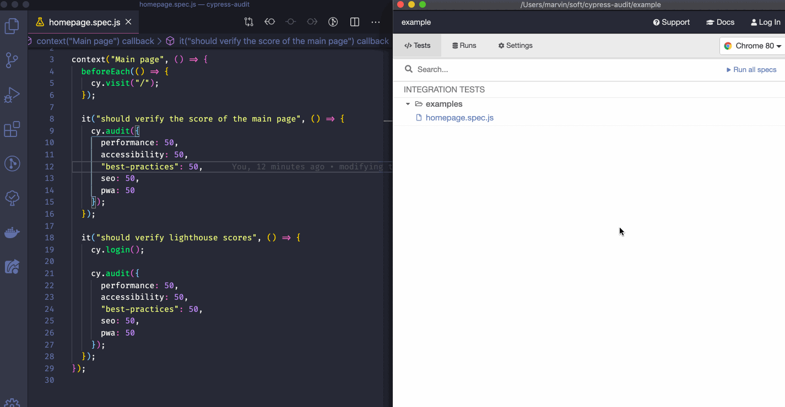

:zap: Run Lighthouse audit directly in your E2E test suites.



## Why?

My opinion is that we're using Lighthouse in the browser or in CI only to verify that **the homepage** has good scores. However, a user could open a website from another page than the home one.

With this module, I wanted to facilitate the automation control of Lighthouse in my E2E test suite using a simple command called `cy.audit()`

# Usage

## Installation

In your favorite terminal:

```
$ yarn add -D cypress-audit
```

In your cypress/plugins/index.js, add:

```javascript
const { audit, prepareAudit } = require("cypress-audit");

module.exports = (on, config) => {
  on("before:browser:launch", (browser = {}, launchOptions) => {
    prepareAudit(launchOptions);
  });

  on("task", {
    audit
  });
};
```

In your cypress/support/commands.js, add:

```javascript
import "cypress-audit/commands";
```

## In your code

You can now use the `cy.audit()` command in your tests:

```javascript
it("should verify the lighthouse scores", function() {
  cy.audit({
    performance: 85,
    accessibility: 100,
    "best-practices": 85,
    seo: 85,
    pwa: 100
  });
});
```

_NB: none of the keys are required, you can put the keys you want and the module will make the assertions based on them._

You can also define the default thresholds in your `cypress.json` file. However, it will be replaced by the `cy.audit` argument if provided:

```json
// cypress.json
{
  "lighthouse": {
    "performance": 85,
    "accessibility": 50,
    "best-practices": 85,
    "seo": 85,
    "pwa": 50
  }
}
```

## Example

The [example](./example) folder of the projects owns a `create-react-app` application with an associated cypress test running lighthouse.
You can run it by:

- Cloning this repo (`$ git clone https://github.com/mfrachet/cypress-audit`)
- Start the application (`$ yarn start`)
- Run the E2E test suite (`$ yarn e2e` for UI and `$ yarn e2e:headless` for headless)
